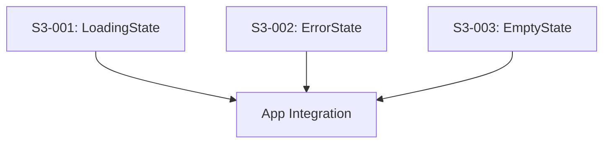

# Sprint 3 Backlog

## Sprint Overview

| Field | Value |
|-------|-------|
| **Sprint Number** | 3 |
| **Sprint Goal** | Deliver polished UI states with clear feedback for loading, errors, and empty states |
| **Start Date** | March 10, 2026 |
| **End Date** | March 24, 2026 |
| **Duration** | 2 weeks |
| **Story Points** | 13 |

## Sprint Goal Statement

> Deliver a polished user experience with clear feedback states — users see appropriate loading indicators during data fetch, helpful error messages with retry capability when things go wrong, and friendly empty state messaging when no tasks exist.

---

## Sprint Backlog

### Epic 5: UI States & Feedback

#### S3-001: Implement LoadingState Component
**Story Reference:** Epic 5, Story 5.1  
**Points:** 5  
**Priority:** P0 - Critical  
**Status:** Done

**As a** user,  
**I want** a loading indicator while data is being fetched,  
**So that** I know the app is working.

**Acceptance Criteria:**
- [x] Loading spinner is displayed when todo fetch takes longer than 200ms
- [x] No loading spinner shown if request completes in under 200ms (prevents flash)
- [x] Spinner has `aria-label="Loading tasks"` for screen readers
- [x] Spinner respects `prefers-reduced-motion` (no spin animation when enabled)
- [x] LoadingState component is reusable with customizable label

**Technical Notes:**
- Use `useState` with `setTimeout` to implement 200ms delay threshold
- CSS animation for spinner, disabled via `prefers-reduced-motion` media query
- Component location: `frontend/src/components/LoadingState/`
- Export from component index for clean imports

---

#### S3-002: Implement ErrorState Component
**Story Reference:** Epic 5, Story 5.2  
**Points:** 5  
**Priority:** P0 - Critical  
**Status:** Done  
**Dependencies:** None

**As a** user,  
**I want** a clear error message when something goes wrong,  
**So that** I know what happened and can try again.

**Acceptance Criteria:**
- [x] Error message "Something went wrong" is displayed when todo fetch fails
- [x] "Try Again" button is visible below the error message
- [x] Clicking "Try Again" triggers a refetch of todos
- [x] Error region has `aria-live="polite"` for screen reader announcement
- [x] Button has minimum 44x44px touch target
- [x] ErrorState component accepts custom message and onRetry callback

**Technical Notes:**
- Use React Query's `isError` and `refetch` from useTodos hook
- Component location: `frontend/src/components/ErrorState/`
- Styling should be calm — no aggressive red colors, use muted tones
- Ensure button meets accessibility touch target requirements

---

#### S3-003: Implement EmptyState Component
**Story Reference:** Epic 5, Story 5.3  
**Points:** 3  
**Priority:** P1 - High  
**Status:** Done  
**Dependencies:** None

**As a** user,  
**I want** a friendly message when I have no tasks,  
**So that** I understand the app is working and ready for input.

**Acceptance Criteria:**
- [x] When no tasks exist at all, display "No tasks yet — add one above!"
- [x] When Active section is empty (only completed tasks), display "All done! 🎉"
- [x] Empty state styling is calm and minimal (no aggressive colors)
- [x] EmptyState component accepts variant prop: 'empty' | 'allComplete'
- [x] Message text is customizable via props

**Technical Notes:**
- Component location: `frontend/src/components/EmptyState/`
- Use CSS modules for styling, leverage existing CSS variables
- Consider subtle icon or illustration (optional, keep minimal per JTBD JS9)
- Integrate with TodoList to show appropriate variant based on state

---

## Sprint Dependencies

All three stories are independent and can be worked in parallel. Integration into the main App/TodoList component should happen as each is completed.

---

## Definition of Done

For each story to be considered "Done":

1. ✅ All acceptance criteria are met
2. ✅ Code follows project conventions (TypeScript, CSS Modules)
3. ✅ Component has appropriate test coverage
4. ✅ Accessibility requirements verified (ARIA, keyboard, contrast)
5. ✅ No TypeScript errors or ESLint warnings
6. ✅ Component integrated into TodoList/App as appropriate
7. ✅ Manual testing completed in browser
8. ✅ Code reviewed (via Dev's code-review workflow)

---

## Risk Assessment

| Risk | Likelihood | Impact | Mitigation |
|------|------------|--------|------------|
| 200ms delay logic complexity | Low | Low | Use proven setTimeout pattern with cleanup |
| ARIA live region timing issues | Medium | Medium | Test with screen readers, use `aria-live="polite"` |
| Empty state integration edge cases | Low | Low | Clear variant props handle all scenarios |

---

## Sprint Notes

- This sprint focuses on user experience polish rather than core functionality
- All stories support JTBD JS2 (Trust Persistence), JS4 (Task Overview), and JS9 (Calm Interface)
- Accessibility is woven throughout — each component must meet WCAG 2.1 AA requirements
- These components complete the UI feedback loop started in previous sprints

