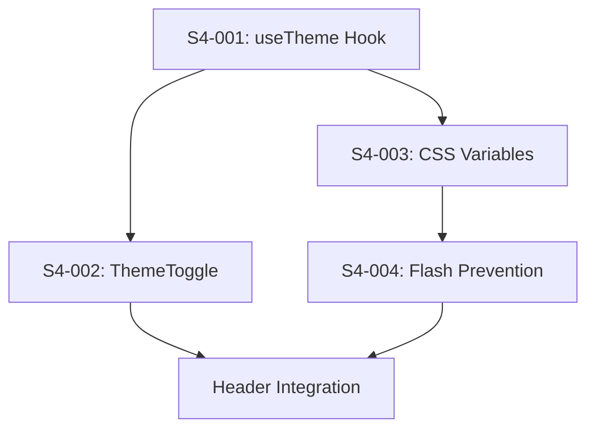

# Sprint 4 Backlog

## Sprint Overview

| Field | Value |
|-------|-------|
| **Sprint Number** | 4 |
| **Sprint Goal** | Deliver dark mode with theme persistence — users can toggle between light and dark themes with their preference remembered |
| **Start Date** | March 10, 2026 |
| **End Date** | March 24, 2026 |
| **Duration** | 2 weeks |
| **Story Points** | 13 |

## Sprint Goal Statement

> Enable users to toggle between light and dark themes, with preferences persisted in localStorage and system preferences (`prefers-color-scheme`) respected on first load. The theme switch should be instant with no flash of wrong theme on page load.

---

## Sprint Backlog

### Epic 6: Dark Mode & Theme Support

#### S4-001: Implement useTheme Hook
**Story Reference:** Epic 6, Story 6.1  
**Points:** 5  
**Priority:** P0 - Critical  
**Status:** Ready for Dev  
**Dependencies:** None

**As a** user,  
**I want** theme preference to persist and respect system settings,  
**So that** the app remembers my choice.

**Acceptance Criteria:**
- [ ] On first load with no saved preference, detect system preference via `prefers-color-scheme`
- [ ] Apply light or dark theme based on system preference detection
- [ ] When saved preference exists in localStorage, it takes priority over system preference
- [ ] Toggling theme switches instantly and saves to localStorage
- [ ] `data-theme` attribute is set on `<html>` element (`"light"` or `"dark"`)
- [ ] Hook returns: `{ theme, toggleTheme, isDark }`
- [ ] Listens to system preference changes (mediaQuery change listener)

**Technical Notes:**
- Hook location: `frontend/src/hooks/useTheme.ts`
- localStorage key: `bmad-todo-theme`
- Use `window.matchMedia('(prefers-color-scheme: dark)')` for system detection
- Update `document.documentElement.dataset.theme` for CSS integration
- Consider using React context for global theme access

---

#### S4-002: Implement ThemeToggle Component
**Story Reference:** Epic 6, Story 6.2  
**Points:** 3  
**Priority:** P0 - Critical  
**Status:** Ready for Dev  
**Dependencies:** S4-001 (useTheme hook)

**As a** user,  
**I want** a visible toggle to switch themes,  
**So that** I can change the theme easily.

**Acceptance Criteria:**
- [ ] Toggle displays sun icon (☀️) when in light mode
- [ ] Toggle displays moon icon (🌙) when in dark mode
- [ ] Clicking toggle switches theme instantly
- [ ] Toggle is positioned in the header area
- [ ] `aria-label` updates dynamically: "Switch to dark mode" / "Switch to light mode"
- [ ] Touch target is minimum 44x44px
- [ ] Visible focus ring on keyboard focus (2px outline)
- [ ] Toggle is keyboard accessible (Tab, Enter/Space to activate)

**Technical Notes:**
- Component location: `frontend/src/components/ThemeToggle/`
- Use CSS modules for styling
- Consider subtle transition on icon swap (optional, respect reduced motion)
- Icons can be emoji or SVG (emoji keeps bundle small)

---

#### S4-003: Implement Dark Mode CSS Variables
**Story Reference:** Epic 6, Story 6.3  
**Points:** 3  
**Priority:** P0 - Critical  
**Status:** Ready for Dev  
**Dependencies:** S4-001 (useTheme hook sets data-theme)

**As a** user,  
**I want** all UI elements to adapt to dark mode,  
**So that** the app is comfortable in low-light conditions.

**Acceptance Criteria:**
- [ ] `[data-theme="dark"]` selector overrides all color CSS variables
- [ ] Dark mode color palette per architecture spec:
  - Background: #1a1a2e → #16213e gradient or solid dark
  - Surface: #1e1e2e
  - Text primary: #e4e4e7
  - Text secondary: #a1a1aa
  - Accent: #60a5fa (accessible blue)
  - Error: #f87171
  - Success: #4ade80
  - Border: #374151
- [ ] All backgrounds, text, borders, buttons, inputs adapt to theme
- [ ] Color contrast remains ≥ 4.5:1 in dark mode (WCAG 2.1 AA)
- [ ] No hardcoded colors bypass the theme (audit all components)
- [ ] Smooth color transitions (150ms) when switching themes

**Technical Notes:**
- Update `frontend/src/styles/variables.css` with `[data-theme="dark"]` overrides
- Audit all CSS modules for hardcoded colors
- Test contrast with browser DevTools or axe-core
- Ensure shadows adapt (lighter or no shadows in dark mode)

---

#### S4-004: Implement Theme Flash Prevention
**Story Reference:** Epic 6, Story 6.4  
**Points:** 2  
**Priority:** P1 - High  
**Status:** Ready for Dev  
**Dependencies:** S4-003 (CSS variables must exist)

**As a** user,  
**I want** no flash of wrong theme on page load,  
**So that** the experience feels polished.

**Acceptance Criteria:**
- [ ] When dark mode is saved and page reloads, no white flash occurs
- [ ] Theme is applied before first paint
- [ ] Inline `<script>` in `<head>` sets `data-theme` before stylesheets load
- [ ] Script is synchronous (not `defer` or `async`)
- [ ] Script handles: 1) localStorage preference, 2) system preference fallback, 3) default to light

**Technical Notes:**
- Add blocking script to `frontend/index.html` in `<head>` before CSS links
- Script should be minimal (no dependencies, pure JS)
- Example pattern:
  ```html
  <script>
    (function() {
      const saved = localStorage.getItem('bmad-todo-theme');
      const prefersDark = window.matchMedia('(prefers-color-scheme: dark)').matches;
      document.documentElement.dataset.theme = saved || (prefersDark ? 'dark' : 'light');
    })();
  </script>
  ```
- Test by throttling network and observing initial paint

---

## Sprint Dependencies



**Recommended Order:**
1. **S4-001**: useTheme hook (foundation)
2. **S4-003**: CSS variables (can parallel with S4-002 after S4-001)
3. **S4-002**: ThemeToggle component (depends on hook)
4. **S4-004**: Flash prevention (final polish, needs CSS vars)

---

## Definition of Done

For each story to be considered "Done":

1. ☐ All acceptance criteria are met
2. ☐ Code follows project conventions (TypeScript, CSS Modules)
3. ☐ Component/hook has appropriate test coverage
4. ☐ Accessibility requirements verified (ARIA, keyboard, contrast in both themes)
5. ☐ No TypeScript errors or ESLint warnings
6. ☐ Component integrated into App/Header as appropriate
7. ☐ Manual testing completed in browser (both themes)
8. ☐ Code reviewed (via Dev's code-review workflow)

---

## Risk Assessment

| Risk | Likelihood | Impact | Mitigation |
|------|------------|--------|------------|
| Flash of wrong theme on load | Medium | High | Blocking script in `<head>` before CSS |
| Hardcoded colors bypassing theme | Medium | Medium | Audit all CSS modules, use CSS variables only |
| System preference listener not cleaning up | Low | Low | Proper `useEffect` cleanup |
| Color contrast failures in dark mode | Medium | High | Run axe-core audit, check with contrast checker |
| Theme toggle not keyboard accessible | Low | Medium | Standard button semantics, focus ring |

---

## Testing Strategy

### Unit Tests (Vitest + React Testing Library)

| Component/Hook | Key Tests |
|----------------|-----------|
| `useTheme` | System preference detection, localStorage read/write, toggle functionality, mediaQuery listener |
| `ThemeToggle` | Icon display per theme, click toggles theme, keyboard activation, ARIA labels |

### Integration Tests

| Test | Description |
|------|-------------|
| Theme persistence | Toggle theme → refresh → verify theme persists |
| System preference | Clear localStorage → set system to dark → verify dark theme applied |
| Flash prevention | With dark theme saved, throttle network, verify no white flash |

### E2E Tests (Playwright)

| Test | Priority |
|------|----------|
| Toggle theme and verify CSS changes | @p0 |
| Theme persists across page reload | @p0 |
| System preference respected on first visit | @p1 |
| No flash of wrong theme (visual) | @p1 |
| Keyboard accessibility of toggle | @p1 |

### Accessibility Tests

| Test | Tool |
|------|------|
| Color contrast in light mode | axe-core |
| Color contrast in dark mode | axe-core |
| Theme toggle focus visible | Manual + automated |
| ARIA label accuracy | React Testing Library |

---

## Sprint Notes

- This sprint delivers US-5 (Toggle Dark Mode) from the PRD
- All four stories together complete Epic 6
- Color palette follows architecture spec for visual consistency
- Flash prevention is critical for perceived quality — prioritize testing
- After this sprint, only Epic 7 (Production Readiness) remains
- Consider celebrating 🎉 — this is a user-visible delight feature!

---

## Acceptance Criteria Traceability

| PRD Requirement | Story | How Verified |
|-----------------|-------|--------------|
| FR26: Theme toggle visible in header | S4-002 | ThemeToggle component renders |
| FR27: Toggle switches instantly | S4-001, S4-002 | No loading state, immediate DOM update |
| FR28: Preference persisted in localStorage | S4-001 | Unit test + E2E reload test |
| FR29: Respect system preference | S4-001 | mediaQuery detection test |
| FR30: All UI elements adapt | S4-003 | Visual audit + contrast tests |
| NFR17: Color contrast ≥ 4.5:1 | S4-003 | axe-core in both themes |
| NFR18: Touch targets ≥ 44x44px | S4-002 | CSS + E2E bounding box check |

---

*Sprint backlog created by John (PM) on March 10, 2026*

