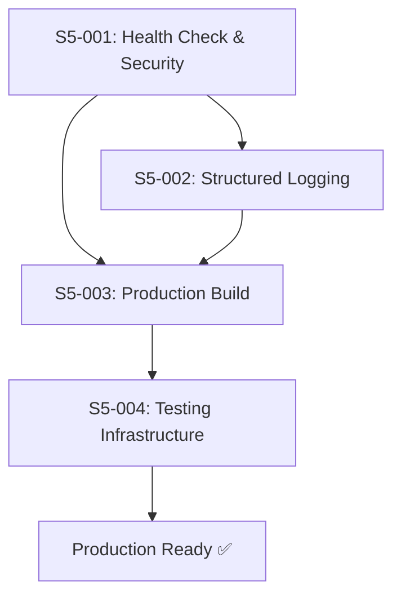

# Sprint 5 Backlog

## Sprint Overview

| Field | Value |
|-------|-------|
| **Sprint Number** | 5 |
| **Sprint Goal** | Deliver production readiness — health monitoring, structured logging, production build pipeline, and verified testing infrastructure |
| **Start Date** | March 25, 2026 |
| **End Date** | April 8, 2026 |
| **Duration** | 2 weeks |
| **Story Points** | 11 |

## Sprint Goal Statement

> Harden the application for production deployment: add health check endpoint with database verification, security headers via Helmet, CORS configuration, structured logging with Pino, production build serving from Express, and fully verified testing infrastructure with coverage thresholds. After this sprint, clearday is deployable and observable.

---

## Sprint Backlog

### Epic 7: Production Readiness

#### S5-001: Implement Health Check & Security Middleware
**Story Reference:** Epic 7, Story 7.1  
**Points:** 3  
**Priority:** P1 - High  
**Status:** Ready for Dev  
**Dependencies:** None

**As a** developer,  
**I want** a health check endpoint that verifies database connectivity and security headers on all responses,  
**So that** the app is production-ready with proper monitoring and hardened HTTP responses.

**Acceptance Criteria:**
- [ ] `GET /api/health` returns 200 with `{ "status": "healthy", "timestamp": "<ISO8601>" }` when DB is accessible
- [ ] `GET /api/health` returns 503 with `{ "status": "unhealthy" }` when DB is unavailable
- [ ] Health check verifies database connectivity by executing a real query
- [ ] Helmet middleware adds security headers to all responses (X-Content-Type-Options, Strict-Transport-Security, etc.)
- [ ] CORS configured with `origin` set to `process.env.FRONTEND_URL || 'http://localhost:5173'` and methods `['GET', 'POST', 'PATCH', 'DELETE']`
- [ ] All existing tests (208+) continue to pass — zero regressions
- [ ] New tests cover healthy state, unhealthy state, security headers, and CORS configuration

**Technical Notes:**
- Health check location: `backend/src/routes/health.ts`
- Security middleware location: `backend/src/middleware/security.ts`
- Use `helmet` package for security headers
- Use `cors` package for CORS configuration
- Health check should execute `db.select().from(todos).limit(1)` to verify DB
- Architecture reference: Sections 7.3, 7.4, 13.2

---

#### S5-002: Implement Structured Logging
**Story Reference:** Epic 7, Story 7.2  
**Points:** 3  
**Priority:** P1 - High  
**Status:** Ready for Dev  
**Dependencies:** S5-001 (middleware foundation)

**As a** developer,  
**I want** structured logging with Pino that logs requests with method, path, status, and duration,  
**So that** I can debug and monitor the application effectively.

**Acceptance Criteria:**
- [ ] All application logging uses Pino structured logger (no `console.log` in production code)
- [ ] HTTP requests logged with method, path, status code, and response duration
- [ ] Development environment uses `pino-pretty` for human-readable log output
- [ ] Production environment outputs JSON-formatted logs (no pino-pretty)
- [ ] Log level configurable via `LOG_LEVEL` environment variable (default: `info`)
- [ ] All existing tests (208+) continue to pass — zero regressions
- [ ] New tests verify request logging middleware captures method, path, status, and duration

**Technical Notes:**
- Logger location: `backend/src/middleware/logger.ts`
- Use `pino` package for structured logging
- Use `pino-pretty` as dev dependency for development formatting
- Request logging middleware should calculate duration using `process.hrtime` or `Date.now()`
- Architecture reference: Section 13.1

---

#### S5-003: Configure Production Build & Static Serving
**Story Reference:** Epic 7, Story 7.3  
**Points:** 3  
**Priority:** P1 - High  
**Status:** Ready for Dev  
**Dependencies:** S5-001, S5-002 (middleware must be in place before production config)

**As a** developer,  
**I want** Express to serve the frontend build in production mode with SPA fallback,  
**So that** the app deploys as a single unit without needing a separate static file server.

**Acceptance Criteria:**
- [ ] `npm run build` compiles frontend to `frontend/dist` and backend to `backend/dist`
- [ ] When `NODE_ENV=production`, Express serves static files from `frontend/dist`
- [ ] All non-API routes return `index.html` (SPA fallback) in production
- [ ] API routes (`/api/*`) are NOT affected by SPA fallback — return proper API responses
- [ ] `npm run start` starts the production server serving both API and static frontend
- [ ] All existing tests (208+) continue to pass — zero regressions
- [ ] Development mode is unaffected — Vite proxy continues to work normally

**Technical Notes:**
- Static serving in `backend/src/index.ts` or dedicated middleware
- Use `express.static('frontend/dist')` for static files
- SPA fallback: catch-all route sends `index.html` for non-API routes
- Must be added AFTER all API routes to avoid conflicts
- Architecture reference: Section 8.2 (Option A: Single Server)

---

#### S5-004: Set Up Testing Infrastructure
**Story Reference:** Epic 7, Story 7.4  
**Points:** 2  
**Priority:** P1 - High  
**Status:** Ready for Dev  
**Dependencies:** S5-003 (full build pipeline must be working)

**As a** developer,  
**I want** a fully verified and documented testing infrastructure,  
**So that** I can confidently write and run tests across all layers.

**Acceptance Criteria:**
- [ ] Vitest runs unit tests for both frontend and backend via `npm run test`
- [ ] React Testing Library is available and configured for component tests
- [ ] Supertest is available and configured for API integration tests
- [ ] Playwright is configured for E2E tests via `npm run test:e2e`
- [ ] axe-core is integrated for accessibility testing (Playwright and component-level)
- [ ] `npm run test` runs all unit tests (shared + backend + frontend)
- [ ] `npm run test:e2e` runs all Playwright E2E tests
- [ ] All existing tests pass — zero regressions
- [ ] Coverage thresholds configured (80% for statements, branches, functions, lines)

**Technical Notes:**
- Verify all existing configs: `vitest.config.ts` (root, frontend, backend), `playwright.config.ts`
- Ensure `@testing-library/react` and `@testing-library/jest-dom` are properly configured
- Supertest should work with Express app export (not server listen)
- axe-core: `@axe-core/playwright` for E2E, `vitest-axe` or manual integration for unit
- Coverage thresholds in vitest config `coverage.thresholds`
- Architecture reference: Section 12

---

## Sprint Dependencies

**Recommended Order:**
1. **S5-001**: Health check & security middleware (foundation — other middleware depends on Express config)
2. **S5-002**: Structured logging (can start after S5-001, logs requests through middleware chain)
3. **S5-003**: Production build & static serving (needs all middleware in place)
4. **S5-004**: Testing infrastructure verification (final — runs against complete production build)

---

## Definition of Done

For each story to be considered "Done":

1. ☐ All acceptance criteria are met
2. ☐ Code follows project conventions (TypeScript, Express middleware patterns)
3. ☐ Story has appropriate test coverage (unit + integration)
4. ☐ No TypeScript errors or lint warnings
5. ☐ All existing tests continue to pass (zero regressions)
6. ☐ Middleware integrated into Express app in correct order
7. ☐ Manual verification completed (health check, headers, build, test commands)
8. ☐ Code reviewed (via Dev's code-review workflow)

---

## Risk Assessment

| Risk | Likelihood | Impact | Mitigation |
|------|------------|--------|------------|
| Helmet breaks existing functionality (CSP too strict) | Medium | High | Test all features after adding Helmet; use permissive defaults initially |
| CORS config blocks frontend in dev | Low | High | Ensure FRONTEND_URL env var defaults to localhost:5173 |
| Pino middleware adds latency to requests | Low | Low | Benchmark before/after; Pino is high-performance by design |
| SPA fallback intercepts API routes | Medium | High | Add fallback AFTER all API route registrations; test API 404s |
| Production build fails with different paths | Medium | Medium | Test build with `npm run build && npm run start` end-to-end |
| Coverage thresholds fail on existing code | Medium | Medium | Audit current coverage first; adjust thresholds if needed |

---

## Testing Strategy

### Unit Tests (Vitest + Supertest)

| Component | Key Tests |
|-----------|-----------|
| Health check endpoint | 200 healthy response, 503 unhealthy response, DB query execution |
| Security middleware | Helmet headers present, CORS allowed origins, CORS blocked origins |
| Pino logger | Request logging with method/path/status/duration, log level configuration |
| Production static serving | Static file served, SPA fallback returns index.html, API routes unaffected |

### Integration Tests

| Test | Description |
|------|-------------|
| Health + DB | Health endpoint with real DB connection, simulated DB failure |
| Security headers | Full request lifecycle verifies Helmet headers in response |
| Request logging | Full request logs method, path, status, duration to Pino |
| Production build | `npm run build` produces expected output files |

### E2E Tests (Playwright)

| Test | Priority |
|------|----------|
| Health check endpoint responds correctly | @p0 |
| App loads and functions in production build | @p0 |
| Security headers present in responses | @p1 |
| All existing E2E tests pass against production build | @p1 |

### Regression Tests

| Test | Description |
|------|-------------|
| Full test suite | All 208+ existing tests pass with zero regressions |
| Theme functionality | Dark mode, toggle, persistence still working |
| CRUD operations | Add, complete, delete todos still working |
| Accessibility | axe-core audit passes in both themes |

---

## Sprint Notes

- This is the **final sprint** for clearday — completing Epic 7 means the full project is done! 🎉
- All four stories complete Epic 7: Production Readiness
- After this sprint, all 7 epics will be **done**
- Focus is on backend/infrastructure — no UI changes in this sprint
- Security and logging are production essentials — don't skip Helmet or Pino
- Testing infrastructure verification ensures the full test pyramid is solid
- Consider running a final Epic 7 retrospective after completion
- **Project celebration** — clearday ships! 🚀

---

## Acceptance Criteria Traceability

| PRD/Arch Requirement | Story | How Verified |
|----------------------|-------|--------------|
| AR18: Health check endpoint (GET /api/health) | S5-001 | Supertest + E2E test |
| AR19: Structured logging with Pino | S5-002 | Unit test verifying Pino output |
| AR20: CORS configuration for frontend URL | S5-001 | Integration test with allowed/blocked origins |
| AR21: Express serves static frontend build | S5-003 | Production build + E2E test |
| AR13: Vitest for unit testing | S5-004 | `npm run test` executes successfully |
| AR14: React Testing Library for component tests | S5-004 | Component test runs verified |
| AR15: Supertest for API integration tests | S5-004 | API test runs verified |
| AR16: Playwright for E2E tests | S5-004 | `npm run test:e2e` executes successfully |
| AR17: axe-core for accessibility testing | S5-004 | axe-core integration verified |
| NFR1: Initial page load < 2s | S5-003 | Lighthouse audit on production build |
| NFR5: Data persists in SQLite | S5-001 | Health check verifies DB connectivity |
| NFR11: Input validation (Zod) | S5-004 | Existing tests pass |
| NFR14: Security headers (Helmet) | S5-001 | Response header assertions |

---

*Sprint backlog created by Bob (SM) on March 11, 2026*

